# 🚀 **Order Processing System**

Sistema enterprise de procesamiento de órdenes con **Java 21**, **Go APIs**, **Kafka**, **MongoDB** y **frontend interactivo**.

     

---

## ⚡ **Quick Start (2 minutos)**

### **🎯 Opción 1: Solo Backend (Desarrollo)**
```bash
git clone <repository-url>
cd order-processing-system
scripts/deploy-backend.ps1
```
**Resultado**: APIs Go + Worker Java + Infraestructura
- Product API: http://localhost:8081
- Customer API: http://localhost:8082

### **🌐 Opción 2: Frontend Completo (Demo)**
```bash
git clone <repository-url>
cd order-processing-system
scripts/deploy-frontend.ps1
```
**Resultado**: Todo lo anterior + Interfaz web
- **Frontend Web**: http://localhost:8080
- Order API: http://localhost:3000

---

## 🧪 **Testing Rápido**

### **Script Automatizado** (Recomendado)
```bash
scripts/test-final-system.ps1
```

### **Frontend Visual**
1. Ejecutar: `scripts/deploy-frontend.ps1`
2. Abrir: http://localhost:8080
3. Crear órdenes visualmente

### **Postman Collection**
1. Importar: `postman/Order_Processing_System.postman_collection.json`
2. Importar: `postman/Order_Processing_Environment.postman_environment.json`
3. Ejecutar carpetas en orden

### **Manual con cURL**
```bash
# Health checks
curl http://localhost:8081/health  # Product API
curl http://localhost:8082/health  # Customer API

# Crear orden con catálogo expandido (solo si frontend activo)
curl -X POST http://localhost:3000/api/orders \
  -H "Content-Type: application/json" \
  -d '{"orderId":"test-001","customerId":"customer-premium","products":[{"productId":"product-1"},{"productId":"product-8"}]}'

# Crear orden directo a Kafka con nuevos productos (backend-only)
echo '{"orderId":"test-002","customerId":"customer-5","products":[{"productId":"product-6"},{"productId":"product-9"}]}' | \
  docker-compose exec -T kafka kafka-console-producer.sh --bootstrap-server localhost:9092 --topic orders

# Probar cliente inactivo (va a retry queue)
echo '{"orderId":"test-003","customerId":"customer-inactive","products":[{"productId":"product-7"}]}' | \
  docker-compose exec -T kafka kafka-console-producer.sh --bootstrap-server localhost:9092 --topic orders
```

---

## 📊 **Arquitectura (Resumen)**

```mermaid
graph TB
    U[👤 Usuario] --> F[🌐 Frontend Web :8080]
    F --> API[📨 Order API :3000]
    API --> K[📨 Kafka]
    K --> W[☕ Order Worker Java 21]
    W --> P[🛍️ Product API :8081]
    W --> C[👥 Customer API :8082]
    W --> M[💾 MongoDB]
    W --> R[⚡ Redis]
    P --> M
    C --> M
```



**Flujo**: Frontend → Order API → Kafka → Worker → APIs Go → MongoDB

---

## 🎯 **Casos de Uso**

| Escenario | Comando | Tiempo | Para |
|-----------|---------|--------|------|
| **Desarrollo APIs** | `scripts/deploy-backend.ps1` | 2 min | Desarrollo, testing APIs |
| **Demo/Presentación** | `scripts/deploy-frontend.ps1` | 3 min | Demos, stakeholders |
| **Testing Completo** | `scripts/test-final-system.ps1` | 5 min | Verificación E2E |
| **CI/CD** | `cd infra && docker-compose up -d` | 2 min | Pipelines automáticos |

---

## 🛠️ **Troubleshooting**

### **Servicios no inician**
```bash
docker-compose down -v && docker-compose up -d
# Esperar 45 segundos
```

### **MongoDB sin datos**
```bash
# Verificar inicialización
docker-compose exec mongo mongosh catalog --eval "
  print('Products:', db.products.countDocuments());
  print('Customers:', db.customers.countDocuments());"
```

### **Ver logs**
```bash
docker-compose logs -f order-worker
docker-compose logs -f product-api
docker-compose logs -f customer-api
```

---

## 📚 **Documentación Técnica**

- **[📋 Arquitectura Completa](docs/COMPLETE_ARCHITECTURE_DIAGRAMS.md)** - Diagramas detallados, tecnologías, flujos
- **[⚙️ Configuración Claude](docs/CLAUDE.md)** - Para desarrollo con IA
- **[📄 Especificación Original](prueba.md)** - Requerimientos técnicos

---

## ✅ **Requerimientos Cumplidos**

| Requerimiento | Estado | Implementación |
|---------------|--------|----------------|
| Worker Java 21 | ✅ | Spring Boot WebFlux reactivo |
| Consumo Kafka | ✅ | Consumer groups + rebalancing |
| APIs Go | ✅ | Clean Architecture + MongoDB |
| Enriquecimiento | ✅ | WebClient reactivo |
| Validación | ✅ | Business rules + customer active |
| MongoDB | ✅ | Estructura según especificación |
| Reintentos exponenciales | ✅ | Backoff + dead letter queue |
| Distributed locking | ✅ | Redis locks + TTL |
| Testing | ✅ | Testcontainers + E2E + Postman |

---

**🚀 Sistema listo para producción con 100% cumplimiento de requerimientos técnicos.**