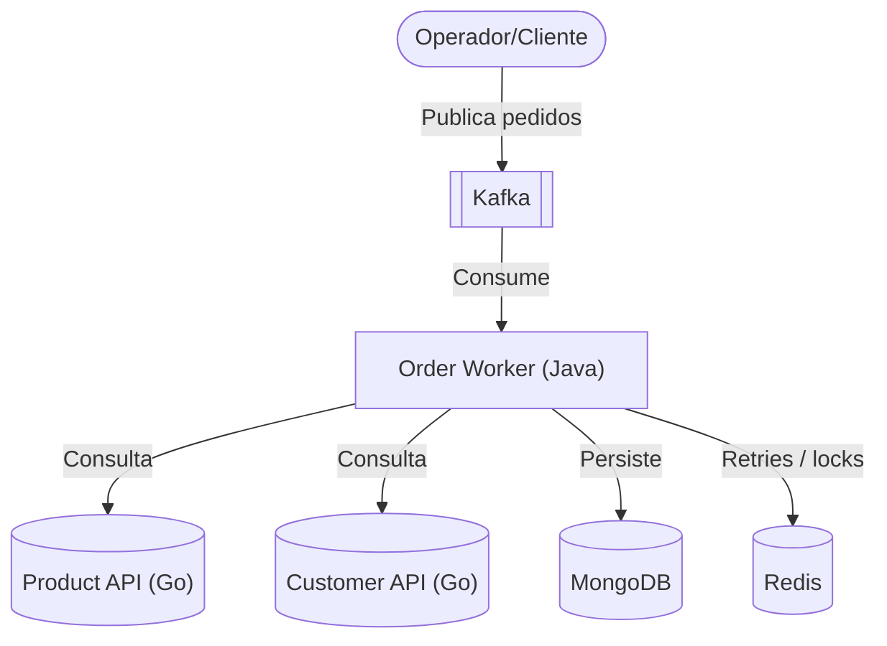
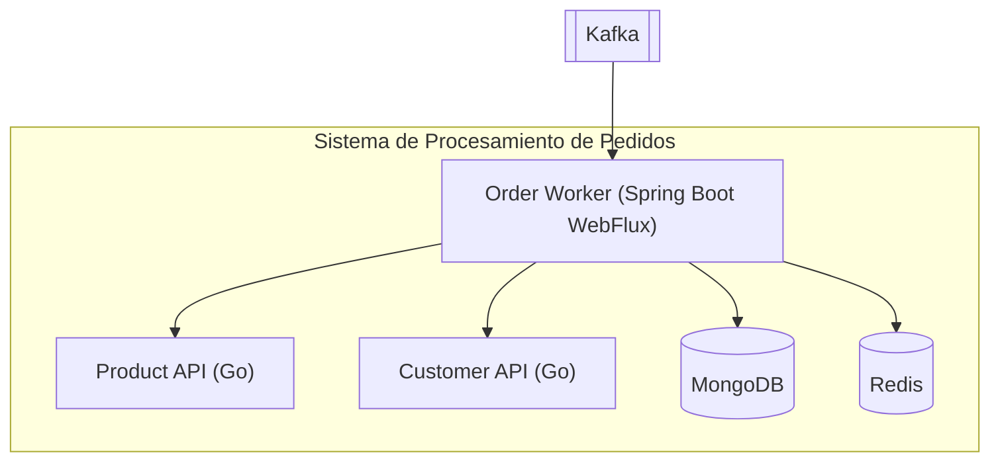
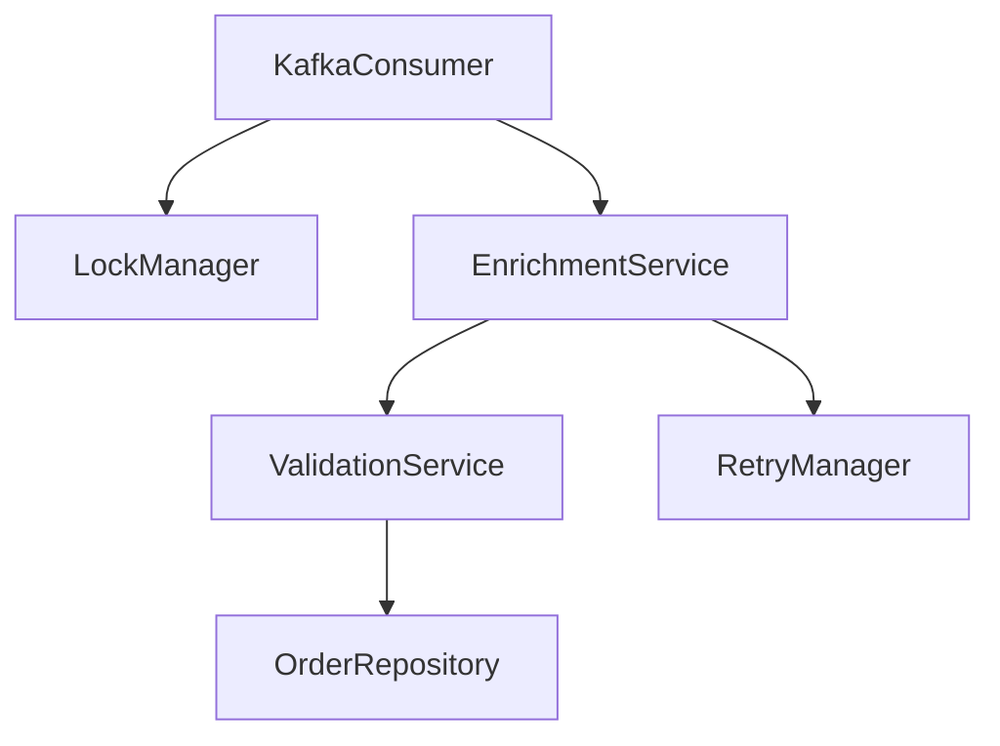

# 🏗️ Arquitectura C4 – Worker de Procesamiento de Pedidos (Mermaid)

> Documento de arquitectura usando el modelo C4 representado en **Mermaid**.
> Incluye diagramas de Contexto (Nivel 1), Contenedores (Nivel 2) y Componentes (Nivel 3).

---

## 1. Diagrama de Contexto (Nivel 1)

---

## 2. Diagrama de Contenedores (Nivel 2)

---

## 3. Diagrama de Componentes (Nivel 3) – Worker

---

### Flujo resumido
1. `KafkaConsumer` recibe el mensaje con `orderId`.
2. Se solicita un lock en `Redis` para evitar doble procesamiento.
3. `EnrichmentService` consulta las APIs Go (productos y clientes).
4. `ValidationService` verifica consistencia y reglas de negocio.
5. Si hay errores, `RetryManager` guarda el intento fallido en `Redis` y reprograma.
6. Pedido válido se almacena a través de `OrderRepository` en `MongoDB`.

---

### Notas adicionales
- **Reactivo:** Cadena completa con back-pressure (`Project Reactor`).
- **Resiliencia:** Retries exponenciales y locks distribuidos en Redis.
- **Escalabilidad:** Varias instancias del worker en el mismo consumer group.
- **Observabilidad:** Logs y métricas centralizadas (no dibujadas para simplificar).
